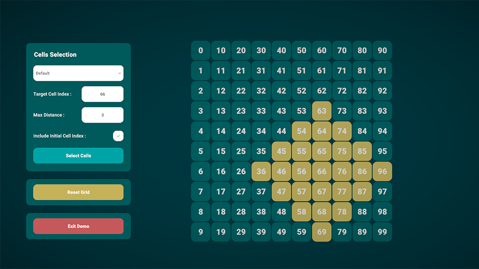
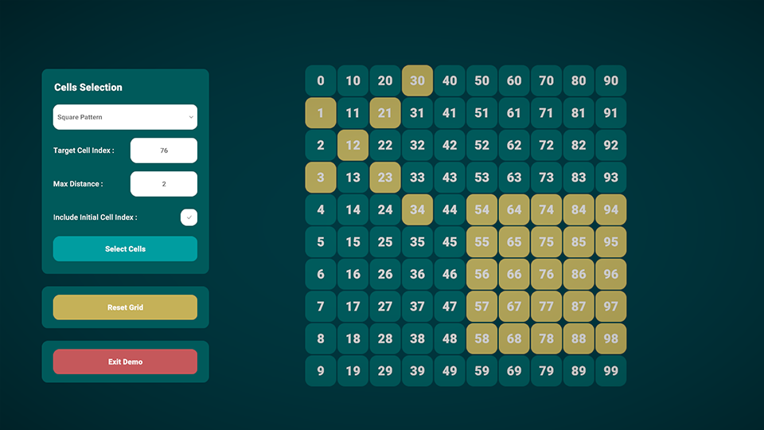

# Grid System Demo

## Overview

This demo showcases a grid system in Unity that allows users to select multiple cells in various patterns and directions. The grid system is implemented in C# and provides functionality for selecting cells in several patterns and direction. This grid system can be useful for tactical RPG games or similar genres, allowing for easy selection and management of grid-based elements.

## Patterns And Directions

- Default Range
- Square Pattern
- Circular Pattern
- Cross Pattern
- Diagonal Pattern
- North Direction
- North-East Direction
- East Direction
- South-East Direction
- South Direction
- South-West Direction
- West Direction
- North-West Direction

## Medias

